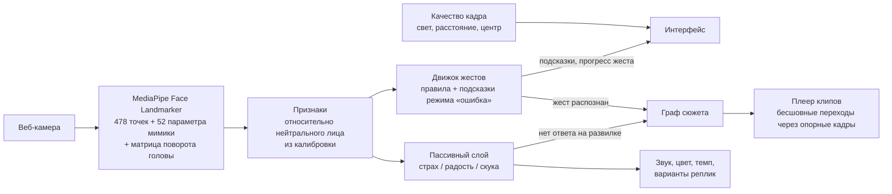

# Архитектура

Всё работает в браузере, серверной части нет. Лицо распознаётся на устройстве зрителя, видео с веб-камеры никуда не отправляется. Фильм — заранее сгенерированные клипы, которые переключаются по графу сюжета.

## Модули

| Путь | Что делает |
|---|---|
| `src/face/` | камера, MediaPipe, поворот головы из матрицы трансформации |
| `src/features/` | признаки мимики относительно нейтрального лица зрителя, калибровка |
| `src/gestures/` | определения жестов, оценка кадра, трекер с удержанием и подсказками, проверка качества кадра |
| `src/mood/` | сглаженные страх, радость и скука; выбор ветки, если зритель не ответил |
| `src/story/` | типы графа сюжета и сам сюжет «Ночной поезд» |
| `tools/comfy/` | генерация кадров и клипов через ComfyUI (Qwen-Image 2512 + Wan 2.2) на арендованном GPU |

## Движок жестов — своя логика (не демо MediaPipe)

MediaPipe отдаёт только сырые числа: координаты точек, 52 коэффициента мимики и матрицу поворота. Сами жесты, пороги и подсказки придуманы и написаны нами:

1. **Калибровка.** 2 секунды нейтрального лица → медиана каждого коэффициента. Дальше все признаки считаются как «подъём над своим нейтральным лицом», поэтому человек с естественной полуулыбкой или низкими бровями не получает ложных срабатываний.
2. **Жест = набор частей.** Например, «искренняя улыбка» = уголки губ вверх **и** прищур глаз (улыбка Дюшена). Части типа `min` задают прогресс, части типа `max` — ограничители («не улыбаться, когда хмуришься»).
3. **Режим «ошибка».** Если зритель явно пытается (прогресс ≥ 45% дольше 0,7 с), но одна часть не выполнена, показывается подсказка именно про эту часть: «Улыбка только губами — прищурь глаза». Отдельно ловятся типичные ошибки (смотрит в сторону только глазами) и слишком короткое удержание («Ты подсмотрел через 1,2 с»).
4. **Удержание.** Жест засчитывается, только если его держат (0,5–2 с). Моргание не считается закрытыми глазами.
5. **Трекер — чистая функция** `(состояние, признаки, время) → (новое состояние, события)`. Поэтому он полностью покрыт unit-тестами без камеры (`src/gestures/gestures.test.ts`).

## Бесшовность

Для каждой развилки есть опорный кадр (HUB). Входящий клип заканчивается на нём, петля ожидания начинается и заканчивается на нём, клипы-ответы начинаются с него. Wan 2.2 умеет генерировать видео по заданным первому и последнему кадрам, поэтому переход из ожидания в ответ получается без склейки.

## Заимствования и заготовки

- **Код до старта хакатона не писался.** Всё в репозитории создано после 28.09 07:00, это видно по истории коммитов.
- **Director's Cut** ([github.com/arpan1221/DirectorsCut](https://github.com/arpan1221/DirectorsCut), хакатон Gemini 3 NYC) — фильм, который меняется по эмоциям зрителя. У репозитория **нет лицензии**, поэтому код оттуда **не используется**. Мы взяли только общую идею «эмоции зрителя влияют на ветку сюжета» и сознательно сделали иначе:

  | Director's Cut | Ночной поезд |
  |---|---|
  | Эмоции распознаёт Gemini на сервере по кадру раз в 10 с | Лицо распознаётся в браузере 30 раз в секунду, камера никуда не отправляется |
  | Зритель пассивен, ветку выбирает агент | Зритель управляет жестами; эмоции — второй, пассивный слой |
  | Картинки и озвучка генерируются во время просмотра (платно, с задержкой) | Клипы сгенерированы заранее: просмотр бесплатный и без задержек |
  | Нет обучения жестам и подсказок | Режим «ошибка»: конкретные подсказки по каждой части жеста |

- **Библиотеки и модели:** MediaPipe Tasks Vision (Apache 2.0), React, Vite; для генерации контента — ComfyUI, Qwen-Image 2512, Wan 2.2 (Apache 2.0).
