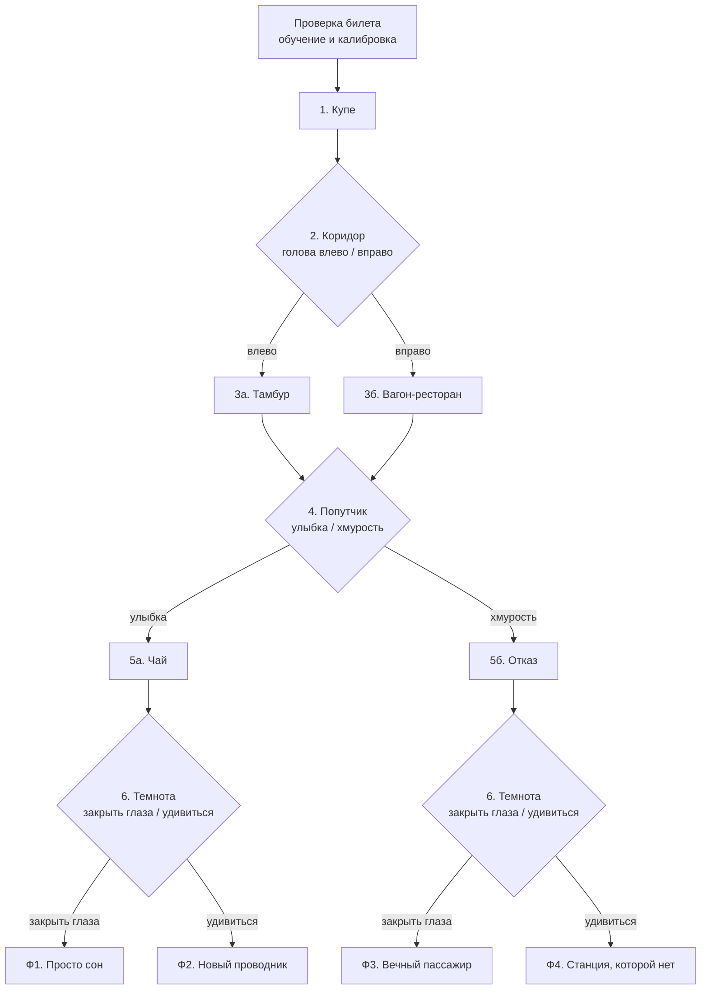

# «Ночной поезд» — сценарий

Интерактивный мистический мультфильм от первого лица, 3–4 минуты. Управление — только лицом: поворот головы, улыбка, нахмуренные брови, удивление, закрытые глаза.

## Логлайн

Ты просыпаешься в купе ночного поезда, который идёт через бесконечную степь и не останавливается до рассвета. Билета у тебя нет — Проводнице он не нужен: «Я запомню ваше лицо». В этом поезде всё решает твоё лицо: куда ты посмотришь, кому улыбнёшься и закроешь ли глаза, когда погаснет свет.

## Мир

- Поезда нет в расписании. Он везёт тех, кто застрял «между» — не решил что-то важное.
- **Проводница** — хранительница поезда. Билеты здесь — это лица пассажиров (так в мир вшита калибровка).
- **Попутчик** — старик, который когда-то сел в этот поезд и так и не решил, куда едет. Едет уже сорок лет. Его тень живёт отдельно от него.
- Стук снаружи на полном ходу — главная загадка первого акта. Стучит старик: так он когда-то пытался выйти.

## Три оси выбора

| Ось | Развилка | Варианты | На что влияет |
|---|---|---|---|
| Любопытство | 1. Коридор | пошёл на стук (тамбур) / пошёл на свет (ресторан) | реплика попутчика, строка эпилога, профиль в билете |
| Доверие | 2. Попутчик | улыбнулся (доверился) / нахмурился (отказал) | **концовка** |
| Смелость | 3. Темнота | окликнул (удивление) / спрятался (закрыл глаза) | **концовка** |

Доверие × Смелость = 4 концовки. Любопытство меняет текст, поэтому вариантов финала 8, а клипов всего 4.

## Граф

## Персонажи (описания для генерации, не менять между кадрами)

- **Проводница** — женщина около 40 лет, бледное лицо, тёмные волосы в тугом пучке, тёмно-синяя железнодорожная форма с латунными пуговицами, маленькая фуражка, латунный керосиновый фонарь. Спокойная, чуть тревожная полуулыбка. Всегда смотрит прямо в камеру.
- **Попутчик** — старик с седой бородой, поношенное шерстяное пальто. Стакан чая в узорном металлическом подстаканнике. Глаза странно блестят. Его тень на стене не повторяет его движений.
- **Ты** — камера. В кадре иногда появляются твои руки, в финалах — отражение в окне.

## Визуальные правила

- Ночь. Два источника света: тёплый янтарный (лампы, фонарь, чай) и холодный лунный (окна). Страх в кадре — это когда тёплого света становится меньше.
- Стиль выбирается по пробам: **A** — стоп-моушн (пластилин, войлок, миниатюра), **B** — нуар-графика (тушь, штриховка).
- Интерфейс: широкий кадр 2.39:1, зерно плёнки, субтитры. Твоё лицо — отражение в тёмном окне вагона с сеткой распознавания.

---

## Пролог: «Проверка билета» (обучение, ~45 с)

Фон: Проводница в дверях купе (зацикленный клип). Каждая реплика — один жест. Реплика ждёт, пока жест получится; ошибки подсвечиваются подсказками. Если шаг не получается 20 секунд, Проводница говорит «Ладно. Поверю на слово» и идёт дальше. Застрять невозможно.

| Шаг | Реплика Проводницы | Жест | Что ловит режим «ошибка» |
|---|---|---|---|
| 0 | «Пассажир, проснитесь. Посмотрите на меня… Билет не нужен — я запомню ваше лицо.» | нейтральное лицо 2 с (калибровка) | нет лица, темно, далеко, близко, не по центру |
| 1 | «Улыбнитесь. Мне нужно знать, что вы живой.» | улыбка | улыбка одними губами, слишком слабая улыбка |
| 2 | «А теперь нахмурьтесь. Как контролёр.» | нахмуриться | хмурится одна бровь, при этом улыбается |
| 3 | «Посмотрите налево… Теперь направо.» | поворот головы | смотрит только глазами, не хватает градусов |
| 4 | «Удивитесь. Здесь это пригодится.» | удивление | только брови, только рот |
| 5 | «И закройте глаза. Досчитайте до двух.» | глаза закрыты 2 с | открыл глаза раньше времени |
| ✓ | «Билет принят. Приятной поездки.» | — | — |

---

## Сцены

У каждой реплики может быть **вариант по настроению зрителя** (страх / радость / скука / спокойствие). Вариант выбирается в момент, когда реплика появляется. Это бесплатный способ сделать фильм «живым»: клип тот же, меняется только текст.

### 1. Купе

- **Кадр:** ночь, купе. Проводница в дверях с фонарём, смотрит в камеру.
- **Движение:** она наклоняет голову, говорит, поворачивается и уходит в коридор. Дверь остаётся открытой.
- **Реплика:** «Не спится? Этот поезд не останавливается до рассвета. Прогуляйтесь… Только окна не открывайте.»
  - страх: «Не бойтесь. Здесь никто не кусается. Почти никто.»
  - радость: «Весёлый пассажир. Редкость для этого поезда.»
  - скука: «Скучаете? Это ненадолго.»

### 2. Коридор — ВЫБОР 1: «Куда идти»

- **Кадр (опорный, HUB-1):** ты в коридоре лицом к окнам, коридор уходит в обе стороны. **Слева** тёмный конец и дверь тамбура с заиндевевшим стеклом, оттуда ритмичный стук. **Справа** тёплый свет и пар из вагона-ресторана.
- **Вопрос:** «Слева кто-то стучит. Справа пахнет чаем. Куда пойдёшь?»
- **Ожидание (петля):** колышутся занавески, мигает лампа, стук не прекращается.
- **Жесты:** голова **влево** → Тамбур; голова **вправо** → Вагон-ресторан.
- **Нет ответа 12 с:** скука > 0.5 → Тамбур (зрителю нужна драма), иначе Вагон-ресторан.
- **Ошибки:** «Ты смотришь в сторону только глазами — поверни всю голову», «Поверни голову влево сильнее — ещё примерно 7°».

### 3а. Тамбур (любопытство: пошёл на стук)

- **Кадр:** холодный тамбур, иней на стекле двери.
- **Движение:** стук снаружи — на полном ходу. На заиндевевшем стекле с той стороны проступает отпечаток ладони, за ним силуэт лица старика. Лампа мигает — за стеклом никого.
- **Реплика:** «Стучат снаружи. На полном ходу.» → «…Показалось?»

### 3б. Вагон-ресторан (любопытство: пошёл на свет)

- **Кадр:** пустой вагон-ресторан, тёплые лампы. На одном столике дымится стакан чая в подстаканнике, рядом старый картонный билет.
- **Движение:** камера подходит к столику. В тёмном окне отражается старик за этим столом, но стул пуст.
- **Реплика:** «Вагон пуст. Только один стакан ещё горячий.»

### 4. Попутчик — ВЫБОР 2: «Доверие»

- **Кадр (HUB-2):** ты вернулся в купе. Напротив сидит старик и протягивает стакан чая. Его тень на стене не повторяет позу.
- **Реплика (зависит от выбора 1):**
  - после тамбура: «Это вы открывали тамбур? Зря. Там холодно…»
  - после ресторана: «Вы из ресторана? Значит, мой чай вы уже видели.»
  - страх: «Не бойтесь. Я здесь давно. Слишком давно.»
- **Вопрос:** «Выпьете со мной? Вы же мне доверяете?»
- **Ожидание (петля):** пар над стаканом, тень шевелится сама по себе.
- **Жесты:** **улыбка** → Чай (доверился); **нахмуриться** → Отказ.
- **Нет ответа 12 с:** радость > 0.3 → Чай, иначе Отказ.
- **Ошибки:** «Улыбка только губами — прищурь глаза, улыбнись по-настоящему», «Сведи обе брови — сейчас хмурится только одна», «Убери улыбку — нахмурься всерьёз».

### 5а. Чай (доверился)

- **Движение:** в кадре твои руки берут стакан. Старик впервые улыбается по-настоящему. За окном проносится табличка станции без названия.
- **Реплика:** «Этот поезд везёт тех, кто не решил, куда едет. Я вот так и не решил.»

### 5б. Отказ (не поверил)

- **Движение:** старик медленно отводит стакан и тонко улыбается. Он сидит неподвижно, а его тень на стене продолжает пить чай.
- **Реплика:** «Правильно. Здесь никому нельзя доверять. Даже мне.»

### 6. Темнота — ВЫБОР 3: «Смелость»

- **Кадр:** гаснет свет, остаётся только луна.
- **Опорный кадр (HUB-3):** тёмное купе, дверь с матовым стеклом. За стеклом по коридору приближается свет фонаря.
- **Реплика:** «Свет гаснет. По вагону кто-то идёт…», затем голос: «Пассажир… Ваш билет».
- **Вопрос:** «Спрячься — закрой глаза. Или окликни того, кто идёт.»
- **Ожидание (петля):** свечение фонаря за стеклом пульсирует, слышны шаги.
- **Жесты:** **закрыть глаза на 2 с** → Спрятаться: пока глаза закрыты, экран темнеет, остаётся только звук — шаги проходят мимо, шёпот «Я запомнила ваше лицо». **Удивление** → Окликнуть: дверь отъезжает, за ней Проводница с фонарём.
- **Нет ответа 12 с:** страх > 0.35 → Спрятаться, иначе Окликнуть.
- **Ошибки:** «Ты подсмотрел через 1,2 с — держи глаза закрытыми 2 секунды», «Закрой глаза полностью — не щурься», «Брови подняты — теперь приоткрой рот», «Рот уже открыт — теперь подними брови».

---

## Финалы

| | Спрятался (закрыл глаза) | Окликнул (удивился) |
|---|---|---|
| **Доверился** | Ф1. Просто сон | Ф2. Новый проводник |
| **Не поверил** | Ф3. Вечный пассажир | Ф4. Станция, которой нет |

### Ф1. Просто сон (доверился + спрятался)
- **Кадр:** утро, твоя комната, солнце. На тумбочке пустой стакан в подстаканнике и старый билет.
- **Эпилог:** «Ты открываешь глаза дома. Всё как прежде. Только на тумбочке — пустой стакан в подстаканнике.»
  - после тамбура: «…а на оконном стекле — отпечаток ладони. Снаружи.»
  - после ресторана: «…и билет на поезд, которого нет в расписании.»

### Ф2. Новый проводник (доверился + окликнул)
- **Кадр:** Проводница в дверях впервые улыбается по-настоящему и протягивает фонарь. В отражении окна ты в форме проводника.
- **Реплика:** «Вы не испугались и не отказали старику. Такие здесь нужны.»
- **Эпилог:** «Теперь ты встречаешь тех, кто не решил, куда едет. Старик сошёл на рассвете — впервые за сорок лет.»

### Ф3. Вечный пассажир (не поверил + спрятался)
- **Кадр:** ты открываешь глаза. Купе пустое, стакан чая в твоей руке. В отражении окна — старик с седой бородой. Это ты.
- **Эпилог:** «Поезд идёт дальше. Ты так и не решил, куда едешь. Скоро в купе сядет новый пассажир — предложи ему чаю.»

### Ф4. Станция, которой нет (не поверил + окликнул)
- **Кадр:** поезд стоит у пустой платформы в туманной степи, горит один фонарь, табличка станции без названия. Ты выходишь, поезд растворяется в тумане.
- **Реплика Проводницы:** «Ваша станция.»
- **Эпилог:** «Ты никому не поверил, но и не спрятался. Твоя станция — та, которую ты выбрал сам.»

---

## Итоги: «Твой билет»

Экран после финала оформлен как железнодорожный билет:

- **Маршрут:** станции, через которые ты проехал (Купе → Коридор → Тамбур → Попутчик → Отказ → Темнота → Станция).
- **Название концовки** и эпилог.
- **Профиль пассажира** по трём осям: «Пошёл на стук / на свет», «Доверился / Не поверил», «Окликнул / Спрятался».
- **Кардиограмма страха** — график страха по ходу фильма с подписью пика («Сильнее всего ты испугался в тамбуре»).
- **Точность жестов:** распознано с первого раза, сколько понадобилось подсказок.
- **Коллекция концовок:** «Открыто 1 из 4» (хранится в браузере).
- **«Улыбнитесь, чтобы проехать снова»** — повтор тоже без клавиатуры и мыши.

## Пассивный слой: эмоции → фильм

| Сигнал | Как считаем | Что меняется |
|---|---|---|
| Страх | брови домиком + широко открытые глаза + растянутые губы | чаще стук колёс, громче низкий гул, темнее края кадра, мигают лампы; при сильном страхе слышно сердцебиение |
| Радость | улыбка | теплее цвет кадра, реплики-варианты «для весёлого пассажира» |
| Скука | лицо без эмоций или взгляд в сторону дольше 6 с | Проводница стучит по «стеклу» экрана: стук, вспышка, «Не спите, пассажир» |
| Нет ответа 12 с | — | ветку выбирает настроение (см. «Нет ответа» в каждой развилке) |

## Список клипов для генерации

Опорные кадры (HUB) — один и тот же кадр в конце входящего клипа, в начале и конце петли ожидания и в начале клипов-ответов. За счёт этого переключение на ответ происходит без склейки.

| # | Файл | Как делаем | Содержание |
|---|---|---|---|
| 1 | `ticket-idle` | петля: первый кадр = последний | Проводница в дверях ждёт (фон обучения) |
| 2 | `wake` | картинка → видео | Проводница говорит и уходит |
| 3 | `corridor` | первый кадр → HUB-1 | выходишь в коридор, поворачиваешься к окнам |
| 4 | `corridor-idle` | петля HUB-1 → HUB-1 | занавески, лампа, стук |
| 5 | `vestibule` | HUB-1 → видео | поворот влево, тамбур, отпечаток ладони |
| 6 | `dining` | HUB-1 → видео | поворот вправо, ресторан, отражение старика |
| 7 | `stranger` | картинка → HUB-2 | старик протягивает чай |
| 8 | `stranger-idle` | петля HUB-2 → HUB-2 | пар, живая тень |
| 9 | `trust` | HUB-2 → видео | руки берут стакан |
| 10 | `refuse` | HUB-2 → видео | старик отводит стакан, тень пьёт |
| 11 | `lights-out` | картинка → HUB-3 | свет гаснет |
| 12 | `lights-out-idle` | петля HUB-3 → HUB-3 | фонарь за стеклом |
| 13 | `call-out` | HUB-3 → видео | дверь отъезжает, Проводница |
| 14 | `end-dream` | картинка → видео | утро дома, стакан и билет |
| 15 | `end-conductor` | из конца `call-out` | фонарь в твоих руках, отражение в форме |
| 16 | `end-forever` | картинка → видео | ты — старик в отражении |
| 17 | `end-station` | картинка → видео | пустая платформа, поезд в тумане |

«Спрятаться» — это затемнение экрана со звуком, отдельный клип не нужен. Итого 17 клипов по 5 секунд и около 10 опорных картинок.
